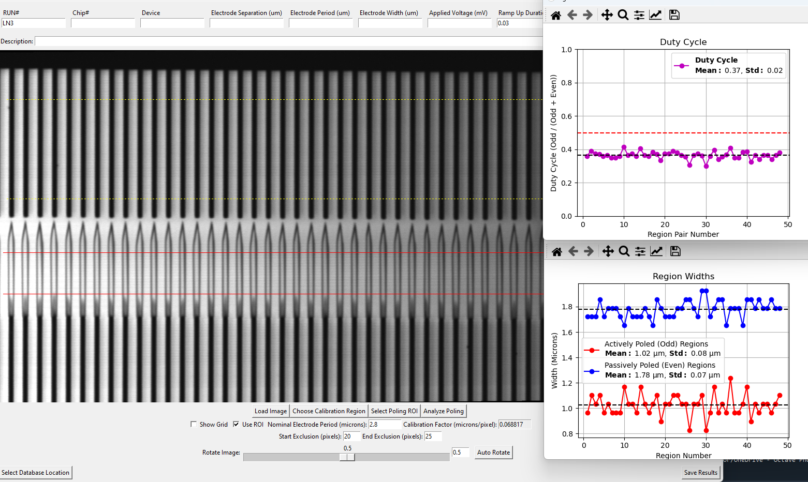

# PPLN Analyzer

### A Tool for Image Processing and Analysis of Periodically Poled Lithium Niobate (PPLN) Structures

## Table of Contents

- [Overview](#overview)
- [Features](#features)
- [Installation](#installation)
- [Usage](#usage)
  - [Loading Images](#loading-images)
  - [Rotating Images](#rotating-images)
  - [Calibrating pixels to microns](#Calibrating-pixels-to-microns)
  - [Selecting Regions of Interest (ROI)](#selecting-regions-of-interest-roi)
  - [Analyzing Poling Patterns](#analyzing-poling-patterns)
  - [Saving Results](#saving-results)
  - [Customizing Settings](#customizing-settings)
  - [Exploring Data](#exploring-data)
- [Dependencies](#dependencies)
- [Contributing](#contributing)
- [License](#license)
- [Acknowledgments](#acknowledgments)

## Overview

PPLN Analyzer is a Python-based application designed to automate the analysis of periodically poled lithium niobate (PPLN) structures. It provides tools for rotating images, selecting regions of interest (ROI), analyzing poling patterns, and saving results for further study. This tool is particularly useful for researchers and engineers working in the field of nonlinear optics and photonics.

## Features

- **Automatic and Manual Image Rotation**: Aligns images to make the poling patterns vertical.
- **Region of Interest (ROI) Selection**: Allows users to select specific areas of the image for detailed analysis.
- **Poling Pattern Analysis**: Automatically calculates and visualizes the widths of poled regions, duty cycles, and other key metrics.
- **Customizable Settings**: Adjust edge exclusion, calibration factors, and other parameters to suit your specific data.
- **Data Export**: Save analysis results and figures in CSV format and as images.
- **Interactive GUI**: Easy-to-use interface for managing the entire workflow.

## Installation

To get started with PPLN Analyzer, clone this repository and install the necessary dependencies:

```bash
git clone https://github.com/grishaspektor/PPLN-analyzer.git
cd PPLN-analyzer
pip install -r requirements.txt
```

## Usage

### Loading Images

- Open the application and click **Load Image** to select a `.tif` file for analysis.

### Rotating Images

- Use the **Rotate Image** slider or text box to manually rotate the image.
- Click **Auto Rotate** to automatically align the image based on the detected poling pattern.

### Calibrating pixels to microns

- Edit the nominal Electrode Period (microns) textbox of a known region.
- Click the "choose calibration region" and then click on the top and bottom of the regions containing the electrodes with the said period.
- The calibration factor is calculated and updated in the GUI. It is assumed that the dark regions are the electrodes.
### Selecting Regions of Interest (ROI)

- Click **Select Poling ROI** to manually select a region of interest for analysis. By selecting the top and bottom of the region of interset.
- Red lines on the image will represent the defined ROI.
- Adjust exclusion pixels as necessary.
- The period will be calculated on the vertically averaged horizontal profile of the selected ROI.
- It is currently assumed that the first dark transition is the first actively poled region. You should chose the start of the ROI lines to start at a passively poled region.
- The averaged ROI profile will be displayed.
### Analyzing Poling Patterns

- After selecting an ROI, click **Analyze Poling** to calculate and display the widths of poled regions, duty cycles, and other metrics.
- As a current workaround an image of the electrodes overlaid by a green and red line will be presented - this is useful to more accurately determine the actual start and end of the ROI region - due to a problem with the tk display functionality.

### Saving Results

- You can Select Database Locateion customize the database location for saving the analysis results.
- This will create a config.ini file on your computer that will point to the location of the database.
- You should edit the textboxes on the top of the GUI to add the desired information about the analyzed image.

- Click **Save Results** to export the analysis data and images and add a line to the database resutls.
- The plots and extracted data will be saved alongside the loaded image.


### Customizing Settings

- Use the provided text boxes to adjust parameters like electrode separation, applied voltage, and calibration factors.
- Modify the edge exclusion settings to remove unwanted areas from the analysis.

### Exploring Data

- Use tools like `PandasGUI` or `Tableau` to explore the saved CSV data for further insights.

## Dependencies

- Python 3.x
- [Tkinter](https://docs.python.org/3/library/tkinter.html)
- [PIL (Pillow)](https://pillow.readthedocs.io/)
- [NumPy](https://numpy.org/)
- [Matplotlib](https://matplotlib.org/)
- [Pandas](https://pandas.pydata.org/)
- [Scikit-image](https://scikit-image.org/)
- [PandasGUI (optional for data exploration)](https://pandasgui.johnwmiller.org/)

Install all dependencies using:

```bash
pip install -r requirements.txt
```

## Contributing

Contributions are welcome! Please follow these steps:

1. Fork the repository.
2. Create a new branch (`git checkout -b feature-branch`).
3. Make your changes.
4. Commit your changes (`git commit -m 'Add new feature'`).
5. Push to the branch (`git push origin feature-branch`).
6. Open a Pull Request.

## License

This project is licensed under the WTFPL (Do What The Fuck You Want To Public License). You can do whatever you want with this code.
## Acknowledgments

- Thanks to chatgpt for helping developing this tool.


